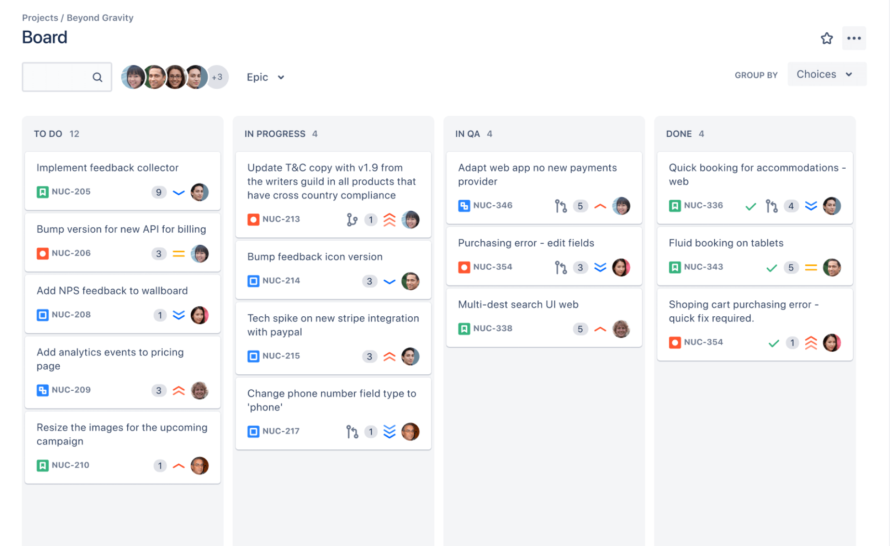
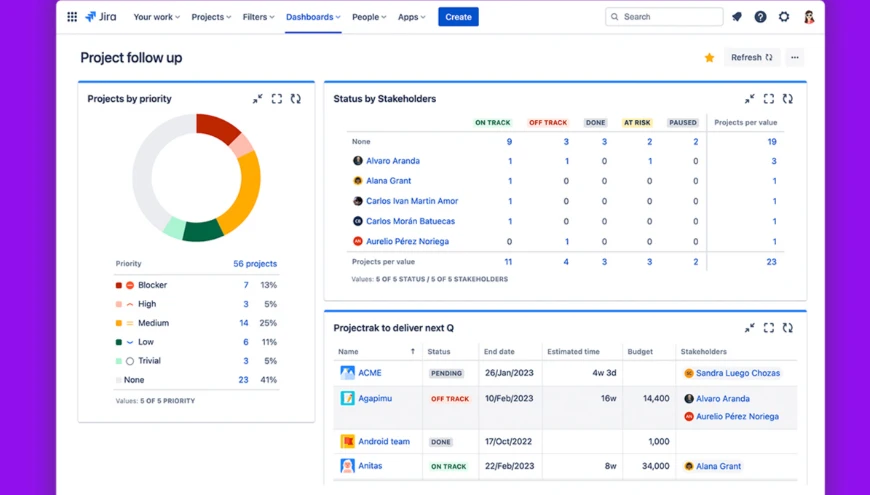
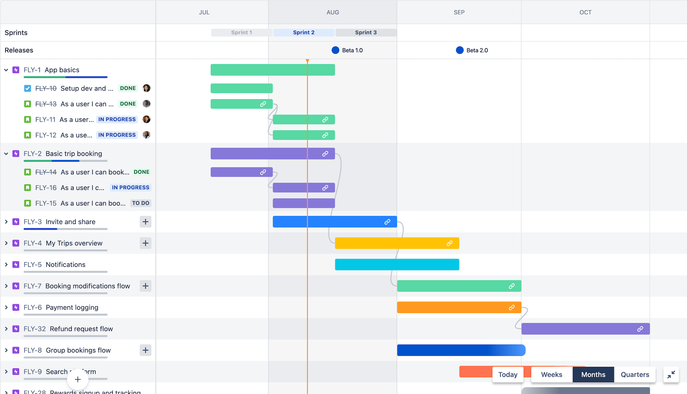
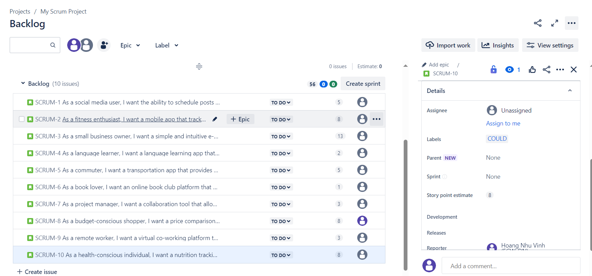
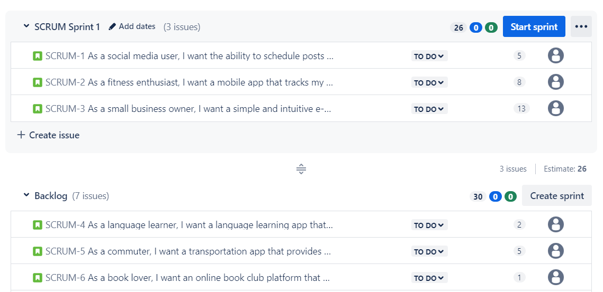
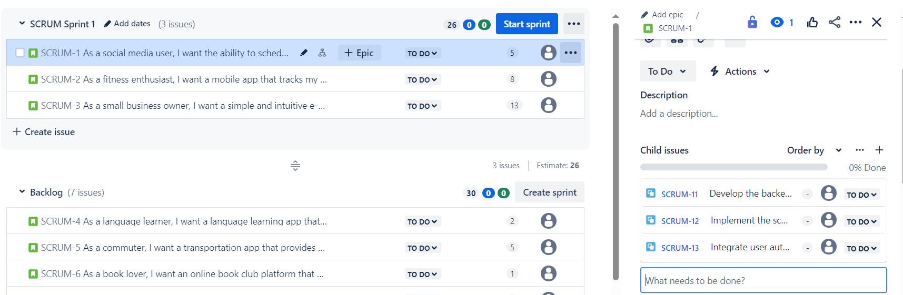
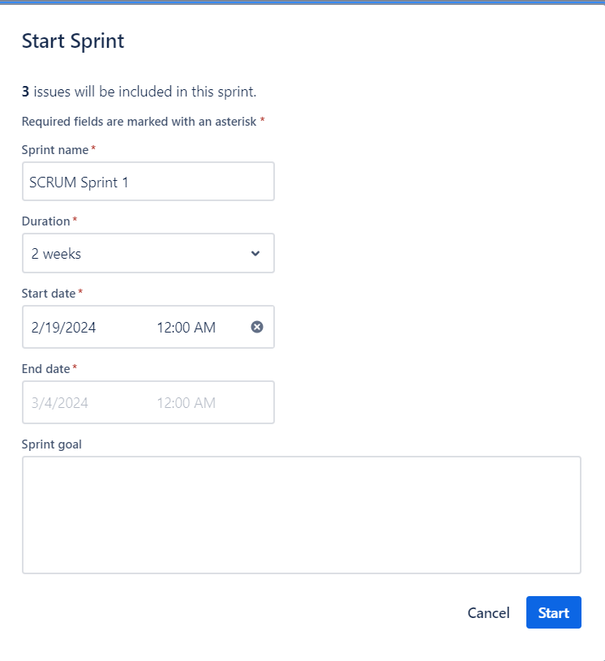
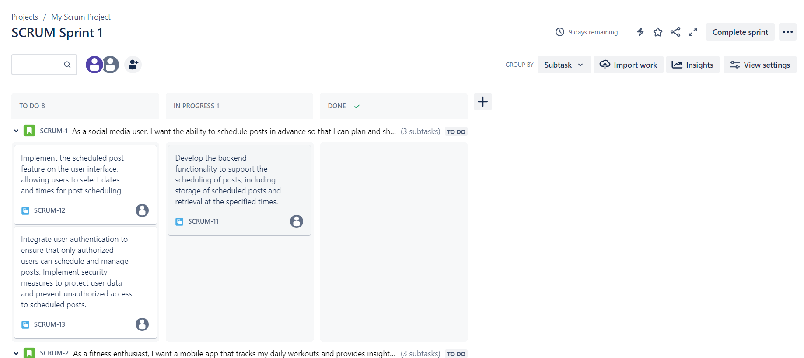
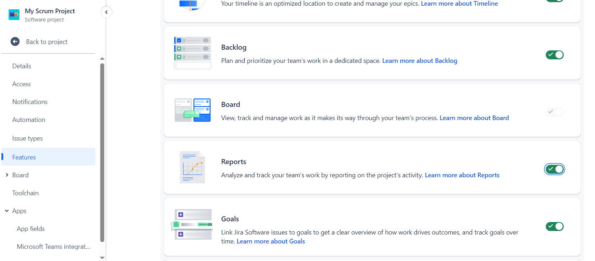
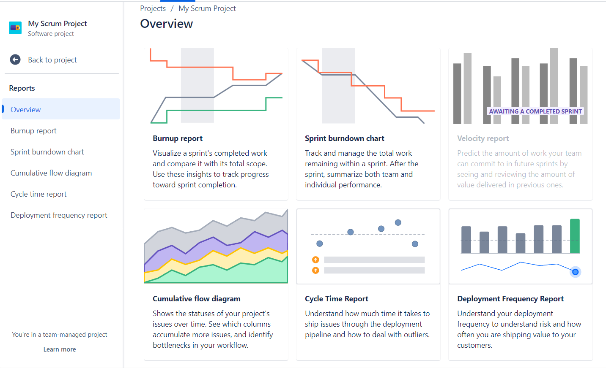

# JIRA

Jira, developed by Atlassian, is a versatile project management and issue tracking tool. Originally designed for software development, it has evolved to serve various industries. Jira facilitates collaboration, task prioritization, and progress tracking through customizable workflows. Supporting agile methodologies, it offers features like Scrum and Kanban. With robust reporting and integration capabilities, Jira is widely adopted for enhancing efficiency and collaboration across teams in different domains.

## Create Backlog

Then add to backlog

After that, create Task

Then, start the Sprint

Config the Board to see the Subtask, you can assign member to perform the task

Activate the Report Feature

Then, you can see a lot of Reports

